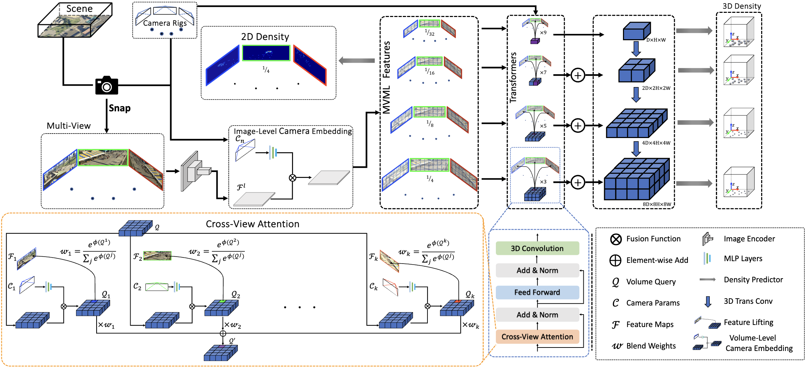
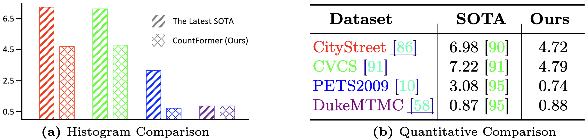

# CountFormer: Multi-View Crowd Counting Transformer

## Introduction
[](https://arxiv.org/abs/2407.02047)

This repository is an official implementation of [CountFormer](https://arxiv.org/abs/2407.02047).
CountFormer is a concise 3D multi-view counting (MVC) framework towards deployment in real-world deployment.

* We creatively design a revolutionary multi-view counting (MVC) framework, called CountFormer, which is the first attempt to solve the 3D MVC problem to fit a real-world environment.
* A feature lifting module and an MV volume aggregation module are conceived to transform the MV image-level features w.r.t arbitrary dynamic camera layouts into a unified scene-level volume representation.
* We present an effective strategy to embed the camera parameters into the image-level features and the volume query, facilitating accurate and adaptable representation among diverse camera setups.


**Framework of the CountFormer.** The Image Encoder extracts multi-view and multi-level features (MVML) from the multi-view images of the scene. ImageLevel Camera Embedding Module fuses camera intrinsic and extrinsic with the MVML features. The elaborate Cross-View Attention Module, a sophisticated attention component, transforms the image-level features into scene-level volume representations. Besides main components, a 2D Density Predictor is used to estimate the image space density, 3D Density Predictors are employed to regress for the 3D scene-level density, and a simple feature pyramid network fuses the multi-scale voxel features.

## News
**2025.02.18** Release the refined labels w.r.t. the CityStreet dataset.

**2025.02.18** Release the training log & pth on the CSCV benchnark.

**2024.07.08** The code of CountFormer is released on github for research purpose. 

**2024.07.01** The CountFormer has been accepted by the Top-tier conference ECCV 2024.   

## Results in paper
### Comparisions with SOTAs
<div style="text-align: center;">

</div>


## Training Script
After preparation, you will be able to see the following directory structure:
  ```
  CountFormer
  ├── data
  │   ├── cross_view
  │   ├── citystreet
  │   ├── ....
  ├── projects
  │   ├── configs
  │   ├── dataset
  │   ├── modules
  │   ├── registry
  │   ├── ....
  ├── tools
  ├── README.md
  ```
```sh tools/do_train.sh```

**Note that the training of CountFormer necessitate training 3 days on 8x A100 GPUs (80GB)**


## Citation
If you find SparseDrive useful in your research or applications, please consider giving us a star &#127775; and citing it by the following BibTeX entry.
```
@inproceedings{mo2024countformer,
  title={CountFormer: Multi-View Crowd Counting Transformer},
  author={Mo, Hong and Zhang, Xiong and Tan, Jianchao and Yang, Cheng and Gu, Qiong and Hang, Bo and Ren, Wenqi},
  booktitle={Proceedings of the European Conference on Computer Vision (ECCV)},
  year={2024},
  organization={Springer},
}
```

<!-- ## References
<a id="1">[1]</a> Qi Zhang and Antoni B Chan. Wide-area crowd counting via ground-plane density maps and multi-view fusion cnns. In Proceedings of the IEEE/CVF Conference on Computer Vision and Pattern Recognition (CVPR), pages 8297–8306. IEEE, 2019

<a id="2">[2]</a> Qi Zhang, Wei Lin, and Antoni B Chan. Cross-view cross-scene multi-view crowd counting. In Proceedings of the IEEE/CVF Conference on Computer Vision and Pattern Recognition (CVPR), pages 557–567. IEEE, 2021

<a id="2">[3]</a> ames Ferryman and Ali Shahrokni. Pets2009: Dataset and challenge. In IEEE International Workshop on Performance Evaluation of Tracking and Surveillance, pages 1–6. IEEE, 2009.

<a id="2">[3]</a> ames Ferryman and Ali Shahrokni. Pets2009: Dataset and challenge. In IEEE International Workshop on Performance Evaluation of Tracking and Surveillance, pages 1–6. IEEE, 2009.

<a id="2">[4]</a> Ergys Ristani, Francesco Solera, Roger Zou, Rita Cucchiara, and Carlo Tomasi. Performance measures and a data set for multi-target, multi-camera tracking. In Proceedings of the European Conference on Computer Vision (ECCV), pages 17-35. Springer, 2016.

<a id="2">[5]</a> Qi Zhang and Antoni B Chan. Wide-area crowd counting: Multi-view fusion networks for counting in large scenes. International Journal of Computer Vision
(IJCV), 130(8):1938–1960, 2022.

<a id="2">[6]</a> Liangfeng Zheng, Yongzhi Li, and Yadong Mu. Learning factorized cross-view fusion for multi-view crowd counting. In Proceedings of the IEEE International Conference on Multimedia and Expo (ICME), pages 1–6. IEEE, 2021. -->